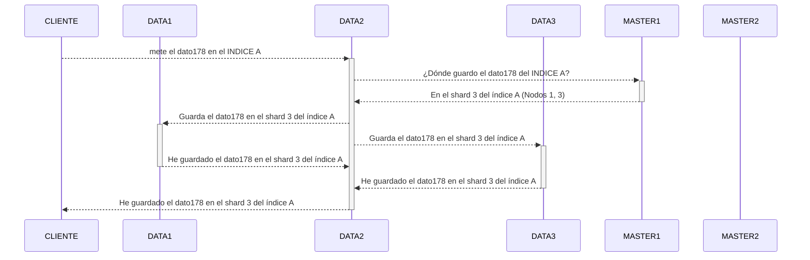
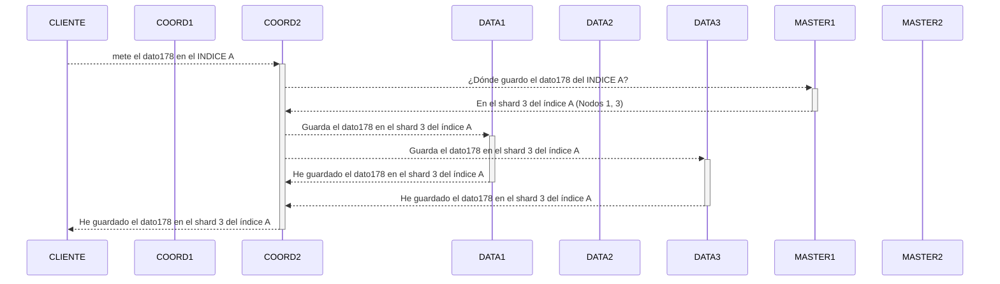
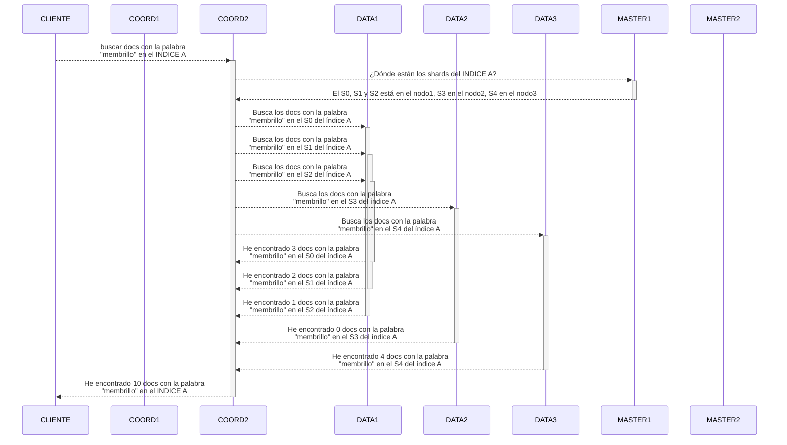

ElasticSearch: Indexador/Motor de búsqueda

Para el indexado se basa en una herramienta Lucene (Apache)
Lucene es un experto en crear índices inversos.

Esos índices inversos llevan un montón de pre-tratamiento de los datos. Este tipo de índices se usa mucho para textos:
- El Quijote / Descripción de un producto
- IP - buscar -> 192.168.20.0/24
Pre-tratamento:
- Tokenización
- Normalización
- Stemming
- Stopwords

En ElasticSearch tenemos plugins que nos permiten hacer por ejemplo búsquedas por palabras homófonas, por ejemplo, si buscamos "vaca" nos devolverá "baca" o "vaca".

CUIDADO!!! Un índice de Lucene no es igual a un INDICE de ElasticSearch.

Indice de ElasticSearch:
- Es una colección de documentos optimizada para su búsqueda. 
  Puede contener los propios documentos o NO.
  Por defecto, Cuando a elasticsearch le pido que indexe un documento, guarda una copia del documento en el índice (_source). Pero eso es algo que puedo cambiar, y pedir que no se guarde el documento en el índice.
- Los índices que permiten buscar los documentos se guardan/gestionan en Shards.
- Un Shard es un Lucene.
- Un índice puede estar dividido en muchos Shards, que a su vez pueden tener réplicas

Elasticsearch no ofrece una interfaz web. Solamente una interfaz por HTTP.
Es habitual en las instalaciones encontrarlo junto con Kibana, que es una interfaz web para Elasticsearch.
Es habitual también encontrarlo junto con Logstash, que es una herramienta de pretratamiento de datos para enviarlos a Elasticsearch.
Es habitual encontrarlos junto a los Beats, que son agentes que recogen datos y los envían a Logstash o a Elasticsearch.
Siempre puedo crear mis propios programas que hagan lo mismo que los Beats, Logstash o Kibana (recopilar/tratar/enviar datos a un ElasticSearch).

Para monitorización de sistemas, Elastic Co. nos ofrece utilidades grandes dentro de la suite ELK y plantillas preconfiguradas. También dashboards preconfigurados (como un grafana).

Hay distintos tipos de nodos en ElasticSearch:
- Master x 3 - Aunque solamente 1 de ellos estará activo.
             - En la practica configuramos 2 nodos master y 1 nodo data de mentirijilla (maestro pero solo para votación).
  - Se encarga de la gestión del cluster.
  - Determinar el Shard donde se guarda un documento.
  - Determinar el nodo donde se guarda un Shard.
- Data x N - Nodos que contienen los datos. (Mínimo muy mínimo es 2)
  - Son los que ejecutan los lucenes.
  - Necesitan mucho almacenamiento (content-hot-warm-cold-frozen)
  - Necesitan mucha RAM y CPU.
  - Trabajos concretos que hacen los data:
    - Tratamiento de los datos para generar los índices invertidos: CPU!
    - Mantener los datos en memoria para que las búsquedas sean rápidas: RAM!
    - Mantener los datos en disco para que no se pierdan: Almacenamiento!

   


   Mi cluster de ES


    Master1 --IPM1------+---IPM2----- Master2
                        |
                        |
    Data1   --IPD1------+---IPD2----- Data2
                        |
                        |

    maestros.mielastic:9300 (BALANCEO DE CARGA) -> Master1:9300, Master2:9300
        Esos balanceadores de carga en kubernetes cómo se llaman: SERVICE

Puerto 9300: Comunicación entre nodos.
Puerto 9200: Comunicación con el mundo exterior.

Imaginad una instalación a hierro (no kubernetes).

Al arrancar un cluster los nodos va a arrancar por separado... pero es necesario que vayan hablando entre si... y se forme el cluster. 
- Antiguamente el descubrimiento de nodos para formar un cluster se hacia mandando una comunicación (broadcast) a la red = QUE PEGAR UN GRITO AL AIRE EN UNA OFICINA
- Hoy en día, ese descubrimiento se hace mediante comunicaciones Unicast = CADA NODO VA A HABLAR DIRECTAMENTE CON LOS QUE EXPLICITAMENTE LE HAYAMOS DICHO QUE HABLE.
 Una vez que un nodo A conoce a un nodo B. Si el nodo B conoce a un nodo C, el nodo B se encarga de presentar al nodo C al nodo A.

Dicho todo esto... 
El nodo Master1 a quien le presento?        Master2 
El nodo Master2 a quien le presento?        
El nodo Data1 a quien le presento?          Master1, Master2 / maestros.mielastic
El nodo Data2 a quien le presento?          Master1, Master2 / maestros.mielastic

A los maestros quién puede comunicarse con ellos? Solo los nodos del cluster
Nadie externo al cluster (programa o persona) debe poder hablar con los nodos master.

En nuestro cluster de 4 nodos.. Si alguien quiere meter datos... contactará con los data...

Delante de los data montaré otro balanceador de carga que se llamará data.mielastic:9200 -> Data1:9200, Data2:9200

Los clientes atacarán a data.mielastic:9200. -> Data2:9200

    mete el dato178 en el INDICE A -> data.mielastic:9200 -> Data2:9200
    Y el ES del Data2... lo primero que hace es hablar con los maestros para ver donde se tiene que guardar el dato178 del INDICE A.
    El maestro que sea activo mirará en que SHARD de ese INDICE A tiene que guardar el dato178 (en base al algoritmo de routing). En el shard 3 del índice.. que está en los nodos 1, 14, y 23.
    Este nodo al que yo he atacado (DATA2) no tiene shards del índice A... el maestro le informa que el shard 3 del índice A está en el nodo 1, 14 y 23... y este nodo (DATA2) le pide a esos nodos que le guarden el dato178 en el shard 3 del índice A. Y este nodo (DATA2) espera a que los nodos 1, 14 y 23 le confirmen que han guardado el dato178 en el shard 3 del índice A... y entonces le responde al cliente que ha guardado el dato178 en el shard 3 del índice A.

El índice A tiene 5 shards... cada uno con una réplica:
    S0 -> S0R0
    S1 -> S1R1
    S2 -> S2R2
    S3 -> S3R3 *** El S3 está en el Nodo3 y el S3R3 está en el Nodo1
    S4 -> S4R4




En un cluster si o si necesito nodos de COORDINACION!
Qué es un nodo de coordinación: Un nodo que no tiene un papel concreto asignados:
- Ni es maestro
- Ni es data
- Ni es machine learning
- Ni es na'
- TU pa lo que haga falta: GESTION !

Lo normal es que ese cluster lo ampliásemos:

    MASTER1 --IPM1------+---IPM2----- MASTER2
                        |
    DATA1   --IPD1------+---IPD2----- DATA2
                        |
    COORD1  --IPC1------+---IPC2----- COORD2

    A los maestros quién puede comunicarse con ellos? Solo los nodos del cluster
    A los datos quién puede comunicarse con ellos? Solo los nodos del cluster
    Los clientes (Kibana incluido) atacarán a coord.mielastic:9200 -> coord1:9200, coord2:9200

Los nodos coordinadores son nodos que necesitan RAM y CPU... pero no necesitan almacenamiento.
Los maestro: CPU
Los data: RAM, CPU, Almacenamiento




Trabajos de los nodos de coordinación:
- Gestionar la carga de documentos en el cluster.
- Qué pasa con las búsquedas?




Por defecto, ElasticSearch distribuye documentos en los shards de forma aleatoria.
Si tengo un índice con 5 shards... en cada uno irá guardando unos documentos diferentes de los que vaya guardando en otro shard.
Cuando toque hacer una búsqueda: Dame TODOS los documentos del INDICE A que contengan la palabra "membrillo"... es necesario buscar en TODOS los shards del INDICE A.

En qué consiste el trabajo del nodo coordinador en este caso? Al haber búsquedas...
1. Determinar los shards que tiene el índice (y los nodos que tienen esos shards)... Preguntando a los maestros.
2. Pedir a los nodos que busquen los documentos en los shards que les corresponda.
3. Recibir los resultados de los nodos y unirlos.
   El problema no es unir en si... sino una operación que ESCONDE ESE UNIR: REORDENARLOS.
   Cada Lucene (shard) me va a devolver los documentos ordenados por relevancia... dentro de ese shard... pero no entre shards.
   Tengo que esperar los resultados de TODOs los shards... y cuando los tenga: reordenarlos.... que no sean 10000 resultados... 100.000 resultados
    ESTO ES LO QUE HACE que necesiten RAM y CPU
4. Una vez reordenados los resultados... responder al cliente con los resultados.

Al hacer inserciones. básicamente:
1. Determinar en qué shard se guarda el documento (y que nodos tiene ese shard)... Preguntando a los maestros.
2. Pedir a los nodos que guarden el documento en el shard que les corresponda.
3. Una vez recibida la confirmación de los nodos de que han guardado el documento... responder al cliente que se ha guardado el documento.

Si no tengo nodos coordinadores, ese trabajo lo asumen:
- Los data o los master... lo que sea que tenga expuesto. Y no debería tener expuesto ninguna de las 2 cosas.
---


Guardo las Facturas de mi empresa.
Lucas guarda las del Cliente A
Fermín guarda las del Cliente B
Menchu guarda las del Cliente C
Marta guarda las del Cliente D

Cuando me piden buscar facturas de Enero...
Yo, coordinador general de la empresa le pregunto a Lucas, Fermín, Menchu y Marta que me den las facturas de Enero de su cliente. Las uno y se las doy a quién me las ha pedido.


--- 

                                                        S0 + S0R0
Tengo un índice con 100k documentos, y el índice ocupa 200Mbs en el disco, teniendo solo 1 shard.

Qué pasa si en lugar de un shard quiero tener 2? S0 + S0R0 = 120 Mbs
                                                 S1 + S1R1 = 120 Mbs
                                                            ---------
                                                             240 Mbs

Qué pasa si en lugar de un shard quiero tener 20? S0 + S0R0 = 25 Mbs
                                                  S1 + S1R0 = 25 Mbs
                                                  ...
                                                  S19 + S19R0 = 25 Mbs
                                                            ---------
                                                                500 Mbs

Ese incremento (lo comentábamos ayer) viene por los términos de búsqueda que se guardan en los shards:
    
    S0 = tortilla -> doc1, doc2, doc3, doc4, doc5, doc6, doc7, doc8, doc9, doc10

    S0 = tortilla -> doc1, doc2, doc3, doc4, doc5
    S1 = tortilla -> doc6, doc7, doc8, doc9, doc10
        * La palabra tortilla aparece en los 2 shards... eso me da un 20% adicional de espacio en disco.

Cuando miro lo que ocupan los índices:
    - Una cosa es lo que ocupan los términos de búsqueda
    - Otra cosa es lo que ocupan las ubicaciones de los términos de búsqueda.

Por partirlo acabo de incrementar el tamaño del índice en disco en 40 Mbs.... EN DISCO no.. En muchos discos.
Cargar ese índice en RAM, ahora requiere un 20% más de RAM.

Y además... al fragmentar mucho el índice.. cuando haya que hacer una búsqueda,
- Tengo que hacer la búsqueda en todos los shards.
- Y esperar a que todos los shards me devuelvan los resultados.
- Y consolidar los resultados de todos los shards (Reordenarlos).

El fragmentar no siempre es buena idea... SOLO GANO velocidad de escritura... 
pero suelo perder velocidad de búsqueda en según qué casos.. 
Necesito más RAM y Disco en los nodos data.

En ocasiones si no tengo mucho problema de velocidad en las inserciones, me interesa más aumentar RAM y CPU que fragmentar el índice. (IR A ESCALADO VERTICAL)

---

# Que a un nodo le ponga role maestro, convierte al nodo en nodo maestro?

No... simplemente es un POTENCIAL MAESTRO.MAestro solo habrá uno, y será elegido internamente por el cluster.

# Que a un nodo le ponga role data, convierte al nodo en nodo data que empiece a recibir peticiones de indexado y búsqueda de documentos?

Si. Los maestros ya le consideran destino posible para guardar documentos y para buscar documentos.

# Que a un nodo no le ponga roles y lo convierta en un nodo de coordinación, convierte al nodo en un nodo de coordinación? 

Si y no... esto es raro.
Básicamente al no ponerle role maestro, no podrá ser elegido maestro.
Básicamente al no ponerle role data, no será tenido en cuenta para guardar documentos, ni para buscar documentos.
Básicamente al no ponerle role de nada... no se le asignará ningún trabajo concreto desde el cluster.

Hará algo entonces este nodo? Atender peticiones externas... PERO OJO, le tiene que llegar EXPLICITAMENTE esas peticiones


    Cliente         ->    COORD1 ->   Data1
                                 ->   Data2
                                 ->   ML1
            -> BC                ->   Master1 **Active**
                                 ->   Master2 (ha votado al otro)
                    ->    COORD2

Si el Coord2 desde fuera no recibe peticiones... no hará nada.

---

# Configuración de INDICES en ES

Al crear un Índice en ES vamos a especificar bastantes configuraciones.
OJO... Si no lo hacemos estamos en RIESGO EXTREMO !
Y esto es uno de los grandes problemas de ES... que por defecto no se configura nada.
Pero puedo empezar a funcionar.
El problema es cuando quiero hacer algo más especial... y si no esté listo / preparado / configurado el sistema para ello, no podré hacerlo, ni ahora ni nunca.
Me toca empezar el proyecto de 0.

Nosotros vamos a cargar documentos JSON en los índices.
Pero, esos JSON tienen campos.. y esos campos tendrán valores... de unos tipos concretos.

```json
{
    "dni": "12345678A",                    // texto
    "nombre": "Fermín",                     // texto
    "edad": 40,                             // numero
    "fecha_nacimiento": "1981-01-01",       // texto
    "ip": "8.27.0.98",                      // texto
    "direccion": {
        "calle": "Calle Falsa 123",         // texto
        "ciudad": "Springfield",            // texto
        "pais": "USA"
    },
    "hijos": [
        {
            "nombre": "Bart",
            "edad": 10
        },
        {
            "nombre": "Lisa",
            "edad": 8
        }
    ]
}
```

// Creamos un campo BUSQUEDA = "12345678A Fermín 40 1981-01-01 USA Springfield Calle Falsa 123"

Si a ES, cuando cree el índice: PERSONAS, no le especifico que vendrá un campo "fecha_nacimiento" que es de tipo fecha... ES lo guardará como texto.
Es más, ElasticSearch incluso no requiere ni siquiera que cree de antemano el índice PERSONAS...
Si le digo: Oye, mete en el índice personas este documento... y no existe el índice PERSONAS... lo crea automáticamente.

---

En ES nosotros NUNCA vamos a crear un índice.
Queremos que los índices se creen en automático.
Mi interés es pedirle a ES que guarde un documento en un INDICE A... y que si el índice no existe, que ES lo cree en automático. Nunca jamás quiero YO estar creando índices manualmente.

En ES Existe el concepto de INDEX TEMPLATE, que es GUAY!
Nosotros lo que vamos a definir es una plantilla de INDICES. Esa plantilla tendrá muchas configuraciones, que heredarán todos los índices a los que se aplique esa plantilla.

Al definir una plantilla se especifica un patrón de nombre de índice... y todas las configuraciones que queremos que tengan los índices que se creen con un nombre que cumpla ese patrón.

> Index template: Personas
                >  aplica a todos los índices que empiecen por "personas_*"  
                >  los índices de de este tipo se crearán con 4 shards y 1 réplica
                >  los documentos que se carguen en índices de este tipo tendrán un campo "fecha_nacimiento" de tipo fecha

> Quiero cargar el documento {...} en el índices "personas_2025_01" (no existe)
>     ES crea el índice "personas_2025_01" en automático
>     Y como su nombre cumple con el patrón de la plantilla, le aplica la configuración de la plantilla.

En una aplntilla de índices (también lo podríamos hacer en un índice directamente), definimos lo que se denominan los mappings.

# Mappings

Indican cómo debe procesarse cada campo de un documento JSON que se cargue en un índice.

Si yo no defino un mapping, ES lo va creando dinámicamente según voy cargando documentos.
Y POR SEGURO NO VA A HACER LO QUE YO NECESITO QUE HAGA.
Siempre va a hacer cosas que en el futuro no me van a permitir hacer lo que necesito.

Esos mappings se defininen en un documento JSON:

```json
{
    "mapping": {
        "properties": {
            "nombre": {
                "type": "text"
            },
            "edad": {
                "type": "integer"
            },
            "fecha_nacimiento": {
                "type": "date"
            },
            "ip": {
                "type": "ip"
            },
            "direccion": {
                "properties": {
                    "calle": {
                        "type": "text"
                    },
                    "ciudad": {
                        "type": "keyword"
                    },
                    "pais": {
                        "type": "keyword"
                    }
                }
            },
            "hijos": {
                "type": "nested",
                "properties": {
                    "nombre": {
                        "type": "text"
                    },
                    "edad": {
                        "type": "integer"
                    }
                }
            }
        }
    }
}
```

# Tipos de campos que podemos definir en los mappings:

- Numéricos: long, double


---

## Nota:

Cuando uso ES + Kibana + Logstash + Beats para montar un sistema de monitorización, Los betas y Logstash y Kibana me ofrecen un montón de plantillas preconfiguradas para los índices que se crean en ES... Y YO ME PUEDO DESENTENDER.

Cuando estoy haciendo algo más customizado... me toca definir mis propias plantillas con mis propios mappings.


---

# "Patatas"

Aplicando un analizador basado en stemmer en español, el término "patatas" se convierte en "patat"


"patatones" -> "Patata", "Patatitas", "Patatón", "Patatón" 
"pata" -> No daría resultados

# "Patatas"

Aplico un analizador basado en trigrama, el término "patatas" 
se convierte en:
- "pat"
- "ata"
- "tat"
- "ata"
- "tas"
  vvvv
"pat" -> 1
"ata" -> 2, 4
"tat" -> 3
"tas" -> 5

"patatones" -> No daría resultados
"pata" -> "Patata", "Patatitas", "Patatón", "Patatón" 

Patatas
---
 ---
  ---
   ---
    ---

Al hacer una búsqueda... en cuanto escriben 3 letras... brutal.

---

- Instalación Básica de ElasticSearch (3 nodos iguales)
- Instalación más completa de ElasticSearch (8/10 nodos diferentes)
- Configurar unos analizadores
- Crear una plantilla de índices
- Cargar datos:
  - Kibana (una utilidad para pruebas en desarrollo)
  - Logstash (una utilidad para cargar datos en ES)
- Consultas básicas en ES
- Consultas más avanzadas en ES
- Monitorización de ES
  - Arquitectura del cluster (cuántos nodos y de qué tipo)
  - Configuración de los nodos
  - Configuración de los índices
- Políticas de ciclo de vida de los índices